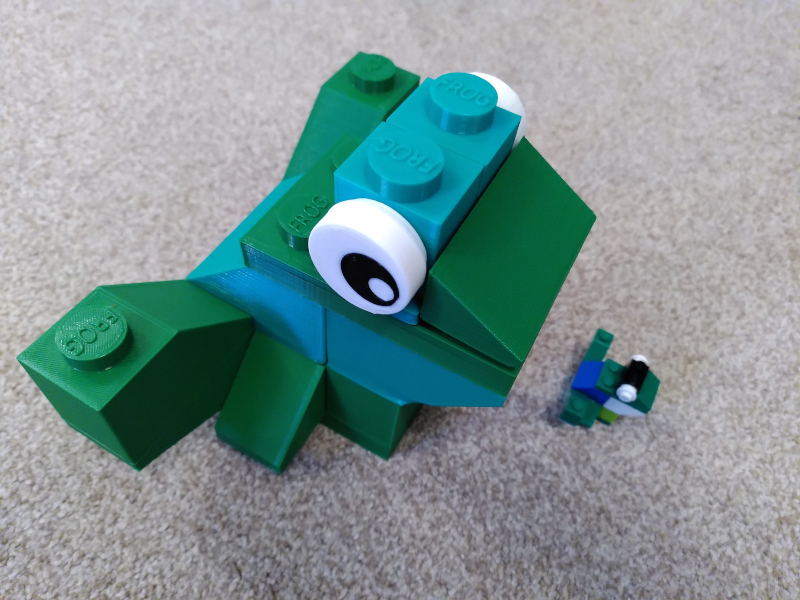

# Bricks OpenSCAD library

A library to make various building bricks.  The default values for sizes and spacing of studs will make bricks compatible with Lego.  This is in no way exhaustive but a number of different bricks and slopes.

Take a look at the demo module and other parts at the end of the file to see how you can make bricks of various shapes and sizes.

# Frog

I used this library to help make a 4x scale frog with my son.  To make 4x scale bricks I exported bricks at normal scale and set them to 400% size in the slicer.  Some of the parts (e.g. the eye) would probably be too small to print at normal scale.

